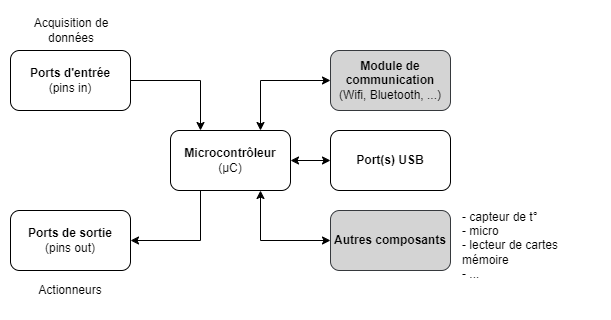

:sectnums: |,all|
:toc: auto

= Les bases de l'Arduino

[NOTE]
====
Dans l'ensemble de ce document, on parlera de carte Arduino. Mais, comme on le verra, il y a une foule de cartes compatibles Arduino et supportée officiellement (ou pas). +
Donc ne vous focalisez pas juste sur les cartes Arduino officielles :)
====

== Qu'est ce que l'Arduino ?

=== Un écosystème avant tout

**Arduino** est un écosystème complet permettant de découvrir l'électronique et la programmation en utilisant des composants simple à mettre en oeuvre. +
C'est une solution **open-source** facile d'accès et très largement documentée.

Les avantages de l'Arduino sont les suivants:

* **relativement économique**: les cartes Arduino (ou Arduino compatibles) sont relativement peu coûteuse, robustes et assez complètes. On peut en trouver dans des tarifs entre 10 et 50€ la carte
* **cross-platform**: l'environement de dévelopement (IDE) est compatible Windows, MAC et Linux
* **IDE simple et clair**: l'IDE est l'environement de développement qui permettra de créer le programme que l'on mettra sur la carte. l'IDE Arduino est simple et facile d'usage même pour les débutants
* **open-source**: le fait que l'environement Arduino soit Open Source permet de trouver de nombreuses cartes, IDE ou composants compatibles Arduino.

---
=== Vue globale

image:./images/arduino_01.png["Vue globale"]

== Les différentes cartes possibles

=== De quoi se compose une carte Arduino ?

Pour commencer, il peut être important de répondre à cette question afin de savoir de quoi on parle. Une carte Arduino se compose des éléments suivants:

* un **microcontrôleur (µC)** : c'est le cerveau de la carte. C'est lui qui pilote l'ensemble des actions qui ont été écrites dans le programme que l'on a poussé sur la cate 
* des **ports d'entrées (pins in)** qui permettent au µC de faire de l'acquisition de données
* des **ports de sorties (pins out)** qui permettant d'activer des ports ou d'anvoyer des signaux
* d'un ou plusieurs **ports USB** pour communiquer avec le µC
* en **option**, la carte peut également proposer:
** des composants supplémentaires (LEDs, capteurs divers et variés, ...)
** un module de communication (Wifi, ...)
** ... ces composants supplémentaires peuvent nécessiter un ensemble de librairies spécifiques pour fonctionner.

La plupart des cartes Arduino sont "simples": rares sont celle qui embarquent des capteurs divers et variés (la Nano 33 BLE sense est une des rares exceptions). +
L'objectif n'est pas de chercher une carte qui contient tout ce dont on a besoin mais plutôt de chosir une carte qui servira de base (si possible qui soit réutilisable dans plusieurs projet) et que l'on complétera en ajoutant différents modules.

---
=== Cartes Arduino officielles

Le link:https://www.arduino.cc/en/hardware[site officiel] Arduino présente une large gamme de cartes.

[cols="^2,^1,^1,5"]
|===
| Carte                         | µC            | Tarifs    | Détails
| Arduino Uno r3                | ATMEG328      | 25€       |  Carte orientée débutant +
                                                           https://store.arduino.cc/products/arduino-uno-rev3
| Arduino Uno r4 +
  (Minimal -> Wifi)             | Renesas RA4M1 | 18-25€    |  Carte orientée débutant +
                                                               https://store.arduino.cc/products/uno-r4-minima + 
                                                               https://store.arduino.cc/products/uno-r4-wifi
| Arduino nano                  | ATMEGA328     | 20€       |  Carte de base
                                                               
| Arduino nano +
  RP2040 Connect                | RP2040        | 25€       |  Carte de base +
                                                               https://store.arduino.cc/collections/boards-modules/products/arduino-nano-rp2040-connect +
                                                               Contient de **nombreux capteurs** +
                                                               Support du **Wifi** +
                                                               **Compatile Arduino et MicroPython**
| Arduino nano 33 IOT           | SAMD21        | 25€       |  Carte de base +
                                                               https://store.arduino.cc/collections/boards-modules/products/arduino-nano-33-iot +
                                                               **Wifi et Bluetooth** +
                                                               Pas de capteurs, juste un **IMU** (centrale inertielle).

| Arduino nano ESP32            | ESP32-S3      | 20€       |  Carte de base +
                                                               https://store.arduino.cc/products/nano-esp32-with-headers +
                                                               Wifi et Bluetooth
| Arduino nano 33 BLE Sense     | nRF52840      | 40€       |  Carte avancée +
                                                               https://store.arduino.cc/collections/boards-modules/products/nano-33-ble-sense-rev2 + 
                                                               Bluetooth +
                                                               Contient de **nombreux capteurs** +
                                                               PAS de connectivité réseau.
|===

---

=== Cartes compatibles

* Adafruit (USA): https://www.adafruit.com/
* Wemos (Chine): https://www.wemos.cc/en/latest/
* Raspberry Pi Pico / Pico W (UK): https://www.raspberrypi.com/documentation/microcontrollers/raspberry-pi-pico.html

[NOTE]
====
Pour les Raspberry Pi Pico et Pico-W suivre le tutorial suivant pour la configuration de l'IDE pour supporter ces cartes.
====

#A COMPLETER#

---
=== Comment choisir sa carte ?

Dans le cadre d'une carte qui servira à la découverte de l'Arduino, privilégiez une carte simple et peu coûteuse. +
Posez vous les questions suivantes:

* la carte aura-t-elle besoin d'**interragir avec une techno particulière** (bus CAN, RS485, I2C, I3C, I2S, ...) ? 
* la carte aura-t-elle **besoin de communiquer** ? 
** wifi ?
** bluetooth ?
** autre ?
* le **choix du µC** est-il important ?
** besoin d'un processeur basique ou puissant ? 
** besoni de beaucoup de mémoire ?
* la carte doit elle permettre de **stocker de la donnée** (datalogger longue durée) ?
* la carte doit elle répondre à des besoins: 
** d'alimentation particuler (3.3v / 5v) ?
** de consommation particulier (fonbctionnement sur batterie uniquement) ?

Pour commencer une Arduino Nano ou Uno suffit largement.

== De quoi a-ton besoin pour commencer ?

La liste suivant vous permettra de couvrir énormément de situation pour apprendre:

* une **carte Arduino** (ou compatible)
* une ou plusieurs **platines d'essais** (breadboard)
* des **fils dupont** (pour la connectique sur la breadboard)
* des **résistances** de différentes valeurs 
* des **LEDs**
* des **boutons** poussoirs 
* différents **capteeurs**:
** humidité (DHT22)
** température (DS18B20)
** ...
