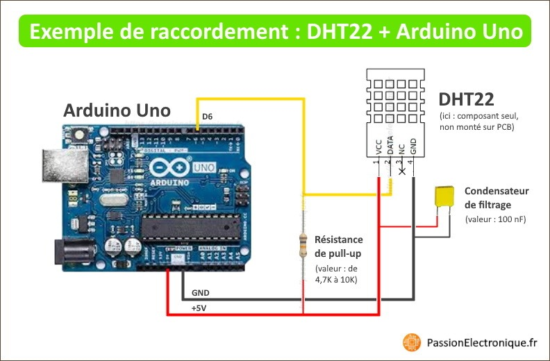
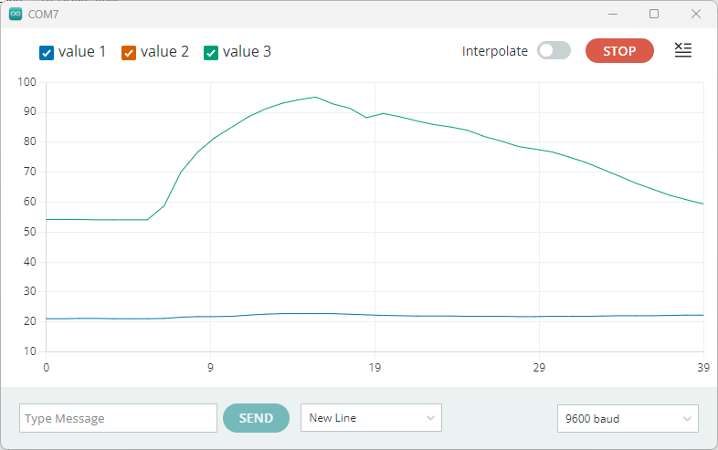

:sectnums: |,all|

= DHT 22

== Objectif

Ce code va permettre de mettre en oeuvre l'usage des librairies. + 
Le capteur que l'on souhaite utilisé (le DHT22)  est un capteur nécessitant un dialogue un peu complexe avec le µC. Toute cette complexité est gérée par les fonctions proposées dans la librairie associée (DHT.h)ce qui simplifie grandement le code. 

l'usage de librairie / package est quelque chose de très largement répandu en programmation. La programmaiton des µC n'y échappe pas.

== Montage

#TO UPDATE#

== Détail du code

=== Import de la librairie

En début de code, on déclare les librairies que l'on souhaite utiliser. +
Ce fichier contient l'ensemble des fonctions nécessaires à l'usage du capteur.

[source,c]
----
#include "DHT.h"
----

=== Déclaration nécessaire au DHT22

Cette section de code permet de définir le port sur lequel est connecter le capteur (DHT_PIN=6). +
Ensuite, on instancie un objet qui nous permettra de communiquer avec le capteur. L'ensemble des actions sur ce capteur se fera via l'objet **dht**.

[source,c]
----
#define DHT_PIN 6

DHT dht(DHT_PIN,DHT22);
----

=== Setup() et Loop()

Dans la fonction **setup()**, on ne fait pas grand chose de plus que d'habitude: 

* on initialise le port serie pour pouvoir envoyé des données du µC vers le port USB
* on initialise l'objet qui porte le capteur (dht) 

[source,c]
----
void setup() 
{
  // Initialize Serial port and write something in it
  Serial.begin(9600);
  Serial.println("----------------------------------------");
  Serial.println("DHT22 Test");
  Serial.println("----------------------------------------");

  // Initialize the instance that maange the DHT22 sensor
  dht.begin();
}

void loop() 
{
  // Use the dht object to read humidity and temperature
  float hum = dht.readHumidity();
  float tempC = dht.readTemperature();

  // Write data to the serial port to be used by SerialPlotter
  Serial.print(tempC);
  Serial.print(" ; ");
  Serial.println(hum);

  delay(2000);
}
----

== Résulat

